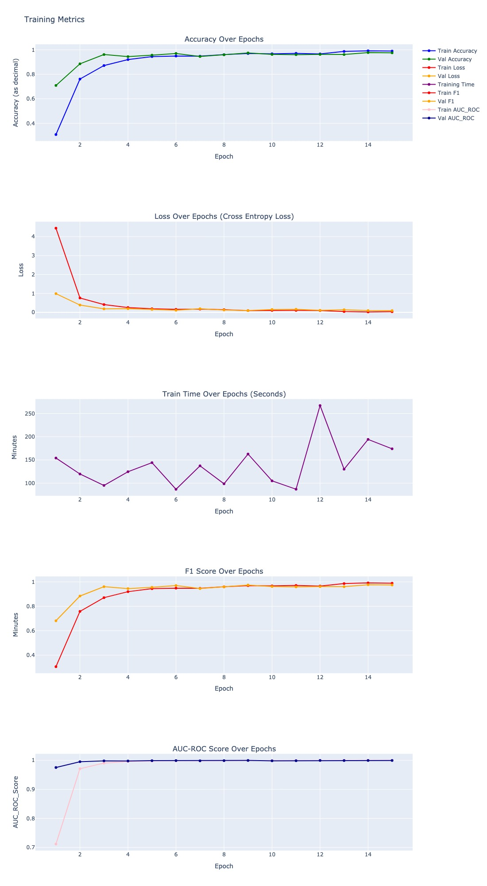
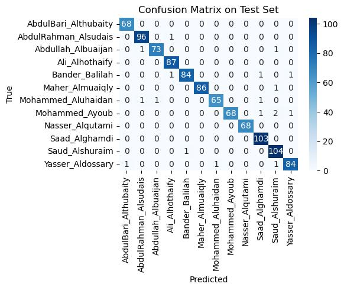

# Pytorch Quran Audio Recitation Multiclassifier
This notebook uses a dataset of audio recordings of recitations of the Quran to create a multiclassifier capable of recognizing the speaker of a recording. As such, this notebook converts audio recordings into spectograms for a PyTorch model to train, validate, and test the model's effectiveness.

Dataset is accessible through the following. The dataset is too large to save via GitHub.

```
!pip install opendatasets --quiet
import opendatasets as od
od.download('http://www.kaggle.com/datasets/mohammedalrajeh/quran-recitations-for-audio-classification', force=False)
```

## Plots for Model

### Confusion Matrix



